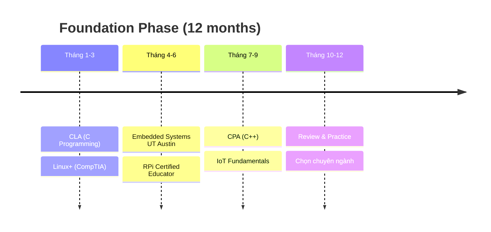
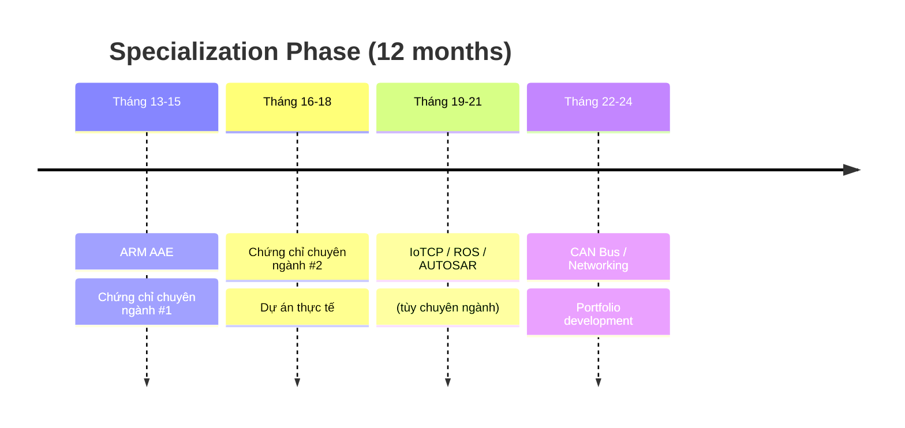
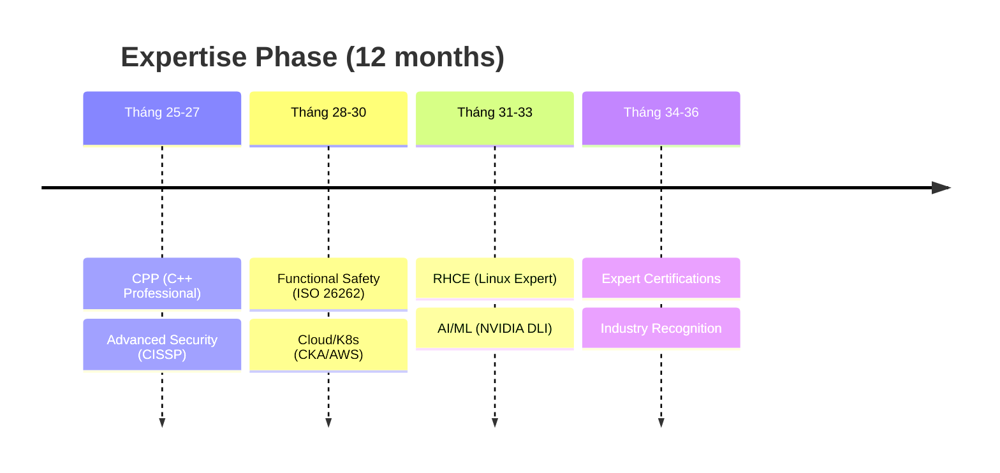

# GPE Engineer Certification Roadmap 2025-2027

## Tổng Quan Roadmap

Đây là lộ trình học tập và chứng chỉ hoá hoàn chỉnh cho **Graduate Program Engineer (GPE)** trong lĩnh vực Embedded Systems, Linux, IoT và Robotics. Roadmap được thiết kế cho 3 năm (2025-2027) với 4 chuyên ngành chính.

## 🎯 Mục Tiêu Roadmap

- **Năm 1**: Xây dựng nền tảng vững chắc (Basic Level)
- **Năm 2**: Chuyên sâu theo ngành (Intermediate Level)  
- **Năm 3**: Trở thành chuyên gia (Advanced/Expert Level)

---

## 🚀 ROADMAP TỔNG QUAN (Timeline 36 tháng)

### **PHASE 1: FOUNDATION (Tháng 1-12) - Basic Level**

### **PHASE 2: SPECIALIZATION (Tháng 13-24) - Intermediate Level**

### **PHASE 3: EXPERTISE (Tháng 25-36) - Advanced Level**

---

## 🎯 ROADMAP CHI TIẾT THEO CHUYÊN NGÀNH

## **1. AUTOMOTIVE EMBEDDED ENGINEER ROADMAP**

### **🔰 PHASE 1: FOUNDATION (12 tháng)**
| Tháng | Chứng Chỉ | Chi Phí | Thời Gian Học | Mục Tiêu |
|-------|-----------|---------|---------------|----------|
| 1-3 | **CLA (C Programming)** | $295 | 120h | Nền tảng C programming |
| 1-3 | **CompTIA Linux+** | $370 | 80h | Linux system admin basics |
| 4-6 | **Embedded Systems UT Austin** | $149 | 100h | ARM microcontroller basics |
| 7-9 | **CPA (C++)** | $295 | 150h | OOP và advanced C++ |
| 10-12 | **Review & Portfolio** | $0 | 80h | Xây dựng portfolio cá nhân |

**📋 Deliverables Phase 1:**
- [ ] C/C++ portfolio với 5+ projects
- [ ] Linux system configuration
- [ ] ARM-based embedded project
- [ ] Documentation & Git workflow

### **⚡ PHASE 2: AUTOMOTIVE SPECIALIZATION (12 tháng)**
| Tháng | Chứng Chỉ | Chi Phí | Thời Gian Học | Mục Tiêu |
|-------|-----------|---------|---------------|----------|
| 13-15 | **ARM Accredited Engineer** | $200 | 120h | ARM architecture chuyên sâu |
| 16-18 | **AUTOSAR ACP** | $650 | 200h | AUTOSAR methodology & tools |
| 19-21 | **CAN Bus Specialist** | $500 | 150h | Automotive networking |
| 22-24 | **Real Project** | $0 | 160h | AUTOSAR-based ECU project |

**📋 Deliverables Phase 2:**
- [ ] AUTOSAR-compliant BSW module
- [ ] CAN communication stack
- [ ] ECU testing & validation
- [ ] Industry internship/project

### **🎖️ PHASE 3: AUTOMOTIVE EXPERT (12 tháng)**
| Tháng | Chứng Chỉ | Chi Phí | Thời Gian Học | Mục Tiêu |
|-------|-----------|---------|---------------|----------|
| 25-27 | **CPP (C++ Professional)** | $295 | 120h | Advanced C++ mastery |
| 28-30 | **ISO 26262 Functional Safety** | $1000 | 200h | Safety-critical systems |
| 31-33 | **CISSP** | $749 | 180h | Automotive cybersecurity |
| 34-36 | **Industry Recognition** | Variable | 120h | Leadership & mentoring |

**🏆 Career Outcomes:**
- Senior Automotive Embedded Engineer
- Functional Safety Engineer
- AUTOSAR Architect
- ECU Team Lead

---

## **2. IOT/CLOUD ENGINEER ROADMAP**

### **🔰 PHASE 1: FOUNDATION (12 tháng)**
| Tháng | Chứng Chỉ | Chi Phí | Thời Gian Học | Mục Tiêu |
|-------|-----------|---------|---------------|----------|
| 1-3 | **CLA (C Programming)** | $295 | 120h | Programming fundamentals |
| 4-6 | **IoT Fundamentals** | $49/month | 80h | IoT ecosystem overview |
| 4-6 | **RPi Certified Educator** | Free | 60h | Hands-on IoT development |
| 7-9 | **CPA (C++)** | $295 | 150h | Object-oriented programming |
| 10-12 | **CompTIA Linux+** | $370 | 100h | Linux for IoT devices |

### **⚡ PHASE 2: IOT SPECIALIZATION (12 tháng)**
| Tháng | Chứng Chỉ | Chi Phí | Thời Gian Học | Mục Tiêu |
|-------|-----------|---------|---------------|----------|
| 13-15 | **ARM AAE** | $200 | 120h | ARM for IoT processors |
| 16-18 | **IoTCP Professional** | $250 | 150h | IoT architecture & protocols |
| 19-21 | **AWS Solutions Architect** | $150 | 180h | Cloud platform expertise |
| 22-24 | **IoT Project** | $0 | 160h | End-to-end IoT solution |

### **🎖️ PHASE 3: IOT EXPERT (12 tháng)**
| Tháng | Chứng Chỉ | Chi Phí | Thời Gian Học | Mục Tiêu |
|-------|-----------|---------|---------------|----------|
| 25-27 | **CKA (Kubernetes Admin)** | $375 | 160h | Container orchestration |
| 28-30 | **CIoTSP (IoT Security)** | $395 | 140h | IoT cybersecurity |
| 31-33 | **NVIDIA DLI** | $270 | 120h | Edge AI & ML |
| 34-36 | **Zephyr RTOS** | $400 | 100h | Real-time IoT OS |

**🏆 Career Outcomes:**
- IoT Solutions Architect
- Cloud IoT Engineer
- Edge Computing Specialist
- IoT Security Expert

---

## **3. ROBOTICS ENGINEER ROADMAP**

### **🔰 PHASE 1: FOUNDATION (12 tháng)**
| Tháng | Chứng Chỉ | Chi Phí | Thời Gian Học | Mục Tiêu |
|-------|-----------|---------|---------------|----------|
| 1-3 | **CLA (C Programming)** | $295 | 120h | Programming basics |
| 4-6 | **RPi Certified Educator** | Free | 80h | Hardware interfacing |
| 7-9 | **Embedded Systems UT Austin** | $149 | 100h | Microcontroller programming |
| 10-12 | **CPA (C++)** | $295 | 150h | OOP for robotics |

### **⚡ PHASE 2: ROBOTICS SPECIALIZATION (12 tháng)**
| Tháng | Chứng Chỉ | Chi Phí | Thời Gian Học | Mục Tiêu |
|-------|-----------|---------|---------------|----------|
| 13-15 | **ROS Developer Certification** | $250 | 180h | Robot Operating System |
| 16-18 | **ARM AAE** | $200 | 120h | ARM for robotics computing |
| 19-21 | **NVIDIA DLI** | $270 | 140h | AI & computer vision |
| 22-24 | **Robotics Project** | $0 | 200h | Autonomous robot project |

### **🎖️ PHASE 3: ROBOTICS EXPERT (12 tháng)**
| Tháng | Chứng Chỉ | Chi Phí | Thời Gian Học | Mục Tiêu |
|-------|-----------|---------|---------------|----------|
| 25-27 | **CPP (C++ Professional)** | $295 | 120h | High-performance computing |
| 28-30 | **CISSP** | $749 | 160h | Robotics cybersecurity |
| 31-33 | **Advanced NVIDIA DLI** | $360 | 120h | Deep learning specialization |
| 34-36 | **Research/Industry** | Variable | 160h | Innovation & leadership |

**🏆 Career Outcomes:**
- Robotics Software Engineer
- AI/ML Robotics Specialist
- Autonomous Systems Engineer
- Robotics Research Engineer

---

## **4. LINUX/RTOS SPECIALIST ROADMAP**

### **🔰 PHASE 1: FOUNDATION (12 tháng)**
| Tháng | Chứng Chỉ | Chi Phí | Thời Gian Học | Mục Tiêu |
|-------|-----------|---------|---------------|----------|
| 1-3 | **CLA (C Programming)** | $295 | 120h | System programming basics |
| 4-6 | **CompTIA Linux+** | $370 | 120h | Linux administration |
| 7-9 | **Embedded Systems UT Austin** | $149 | 100h | Real-time systems |
| 10-12 | **CPA (C++)** | $295 | 140h | System-level C++ |

### **⚡ PHASE 2: LINUX SPECIALIZATION (12 tháng)**
| Tháng | Chứng Chỉ | Chi Phí | Thời Gian Học | Mục Tiêu |
|-------|-----------|---------|---------------|----------|
| 13-15 | **RHCE** | $400 | 200h | Advanced Linux engineering |
| 16-18 | **ARM AAE** | $200 | 120h | ARM Linux systems |
| 19-21 | **Zephyr RTOS** | $400 | 160h | Real-time operating systems |
| 22-24 | **Kernel Development** | $0 | 180h | Linux kernel contributions |

### **🎖️ PHASE 3: SYSTEM EXPERT (12 tháng)**
| Tháng | Chứng Chỉ | Chi Phí | Thời Gian Học | Mục Tiêu |
|-------|-----------|---------|---------------|----------|
| 25-27 | **CPP (C++ Professional)** | $295 | 120h | Performance optimization |
| 28-30 | **Rust Embedded Systems** | $300 | 140h | Memory-safe systems |
| 31-33 | **CKA (Kubernetes)** | $375 | 160h | Container orchestration |
| 34-36 | **Open Source Leadership** | $0 | 120h | Community contributions |

**🏆 Career Outcomes:**
- Linux Systems Engineer
- RTOS Specialist
- Kernel Developer
- Open Source Maintainer

---

## 📊 COST ANALYSIS & ROI

### **Chi Phí Theo Chuyên Ngành (3 năm)**

| Chuyên Ngành | Tổng Chi Phí | ROI Expected | Thời Gian Payback |
|--------------|--------------|---------------|-------------------|
| **Automotive Embedded** | $4,364 | 250-300% | 18-24 months |
| **IoT/Cloud Engineer** | $3,519 | 200-250% | 12-18 months |
| **Robotics Engineer** | $3,363 | 300-400% | 24-30 months |
| **Linux/RTOS Specialist** | $3,579 | 200-300% | 18-24 months |

### **Salary Progression Expectations**

| Phase | Experience | Expected Salary Range (USD) |
|-------|------------|------------------------------|
| **Foundation** | 0-1 years | $65,000 - $85,000 |
| **Specialization** | 1-2 years | $85,000 - $120,000 |
| **Expertise** | 2-3 years | $120,000 - $160,000 |
| **Senior/Lead** | 3+ years | $160,000 - $220,000 |

---

## 🎯 SUCCESS METRICS & KPIs

### **Phase 1 Success Criteria**
- [ ] 100% completion rate for foundation certifications
- [ ] Active GitHub portfolio with 10+ repositories
- [ ] 3+ embedded systems projects completed
- [ ] Linux command line proficiency
- [ ] Basic cloud platform experience

### **Phase 2 Success Criteria**
- [ ] Specialization certifications achieved
- [ ] 1+ industry internship/project completed
- [ ] Technical blog/documentation portfolio
- [ ] Speaking at 1+ technical conferences
- [ ] Mentoring junior developers

### **Phase 3 Success Criteria**
- [ ] Expert-level certifications obtained
- [ ] Leading technical projects
- [ ] Industry recognition (awards/publications)
- [ ] Contributing to open source projects
- [ ] Building engineering teams

---

## 🛠️ RECOMMENDED TOOLS & PLATFORMS

### **Development Environment**
- **IDE**: VS Code, CLion, Eclipse CDT
- **Version Control**: Git + GitHub/GitLab
- **Simulation**: QEMU, Docker, VMware
- **Hardware**: Raspberry Pi, Arduino, STM32 boards

### **Learning Platforms**
- **Online Courses**: Coursera, edX, Udemy
- **Hands-on Labs**: Linux Academy, A Cloud Guru
- **Documentation**: Official vendor docs, GitHub wikis
- **Community**: Stack Overflow, Reddit, Discord

### **Project Platforms**
- **Hardware**: Arduino, Raspberry Pi, ESP32
- **Cloud**: AWS, Azure, Google Cloud
- **Containers**: Docker, Kubernetes
- **CI/CD**: Jenkins, GitHub Actions, GitLab CI

---

## 📅 MONTHLY MILESTONES TRACKING

### **Template for Progress Tracking**

| Month | Target Certification | Study Hours | Practice Projects | Network Events | Status |
|-------|---------------------|-------------|-------------------|----------------|--------|
| Jan 2025 | CLA Prep | 40h | Hello World projects | 1 meetup | 🟡 In Progress |
| Feb 2025 | CLA Exam | 40h | Data structures | 1 conference | ⚪ Planned |
| Mar 2025 | Linux+ Prep | 40h | Shell scripting | 1 workshop | ⚪ Planned |

### **Quarterly Reviews**
- **Q1 2025**: Foundation assessment
- **Q2 2025**: Specialization decision
- **Q3 2025**: Industry alignment check
- **Q4 2025**: Portfolio review

---

## 🤝 NETWORKING & COMMUNITY

### **Professional Organizations**
- **IEEE**: Embedded Systems Society
- **ACM**: Special Interest Groups
- **Linux Foundation**: Membership
- **AUTOSAR**: Partnership events

### **Key Conferences**
- **Embedded World** (Germany)
- **CES** (Consumer Electronics Show)
- **ROSCon** (Robotics)
- **KubeCon** (Cloud Native)

### **Online Communities**
- **Reddit**: r/embedded, r/linux, r/robotics
- **Discord**: Embedded Systems, ROS
- **Stack Overflow**: Active participation
- **GitHub**: Open source contributions

---

## 🔄 CONTINUOUS IMPROVEMENT

### **Annual Roadmap Reviews**
- **Technology Trends**: Emerging technologies assessment
- **Market Demands**: Industry requirements analysis
- **Skill Gaps**: Personal development planning
- **Career Goals**: Long-term objectives alignment

### **Adaptation Strategies**
- **Quarterly Pivots**: Adjust based on industry changes
- **Emerging Certifications**: Add new credentials as available
- **Technology Shifts**: Incorporate bleeding-edge technologies
- **Career Progression**: Scale certifications with seniority

---

**📋 Document Control:**
- **Created**: November 7, 2025
- **Version**: 1.0
- **Next Review**: February 7, 2026
- **Owner**: GPE Program Committee
- **Approved By**: Engineering Leadership Team

---

**📞 Contact & Support:**
- **Program Manager**: [Your Program Manager]
- **Technical Mentor**: [Assigned Mentor]
- **HR Partner**: [HR Business Partner]
- **Budget Approval**: [Finance Contact]